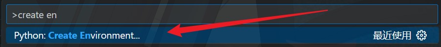
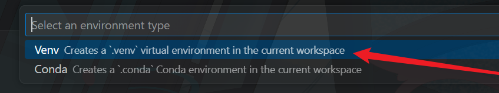
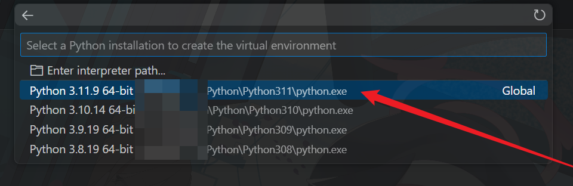
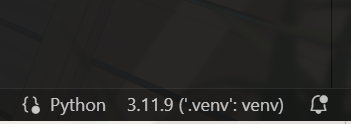
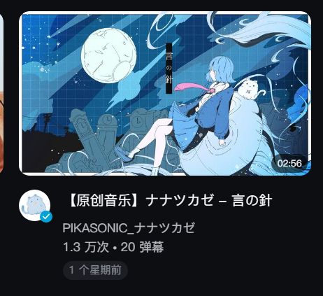
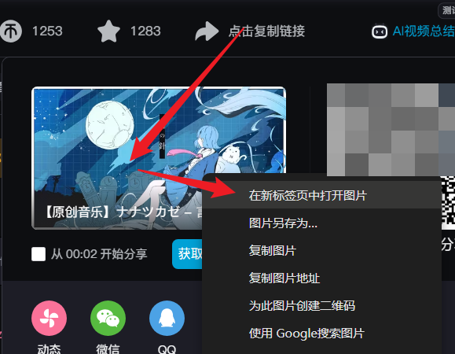
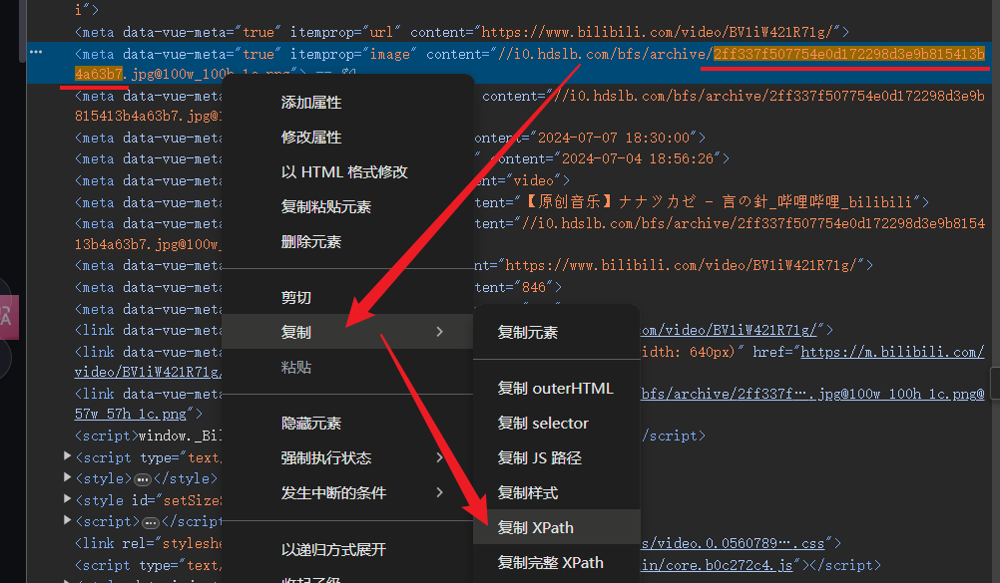

# Proj-01

Simple Video Cover Extractor for Bilibili  

> 简易B站封面提取器  

> 由于这是我们的第一节，仍然会杂一些比较基础的东西。熟悉Python的朋友们可以继续量子速读了。

## 背景

> 想起我最开始学Py的时候，也是从B站下手的（逃）

我们在刷B站的时候，有可能经常会看到一些用某些「好书」来当作封面的视频。为了丰富我们的「知识库存」，我们势必要拿到封面去做以图搜源。 ~~为此有些B站老哥在视频评论区向鸽子UP主苦苦求了几万年（大雾）~~

啊肯定有些机智的朋友知道些别的途径 ~~，像用那些在线工具啊、用「一个■函」APP啊、在网页端按Ctrl+U然后慢慢找啊之类的。~~ 不过我们这次要来尝试自己写一写用来做这个的程序。

## 准备工作

由于这是我们第一次正式开始搓Python项目，我们需要养成一些良好的习惯。 ~~不要像我这样埋头弄三年结果PEP8都不知道~~

在上一节我们已经装好了Python。由于这次我们会用到第三方库，所以要配置虚拟环境。

> 你也不想污染在上一节中刚弄好的全局环境罢（）

照例创建一个项目文件夹，然后使用VSCode打开，信任此文件夹的作者。

### 创建虚拟环境

接下来我们创建虚拟环境（通过VSCode和Venv）。

按`Ctrl+Shift+P`组合键呼出VSCode顶部的运行指令菜单，找到`Python: Create Environment...`



环境类型选择`Venv`



选择合适的解释器



等待创建完成后，在VSCode窗口右下角确认选择的虚拟环境是否正确



> 关于手动创建，参见[补录](./notes.md#手动创建虚拟环境)。

至此，虚拟环境创建完成。

### 安装第三方库

由于Python的标准库中的网络请求库使用体验比较糟糕，所以这里选择第三方库`requests`作为替代。

在VSCode中打开一个新的终端
> 按 `Ctrl+Shift+`\` 启动一个新的终端，或者按 `Ctrl+`\` 切换到已打开的终端。

```powershell
pip install requests types-requests lxml
```
> 安装`types-requests`是为了支持`mypy`静态检查

等待完成后，若无报错即可进入下一步。

## 开始喵

### 寻找途径

首先我们要明确我们的目标，是要获取到B站的某个视频的封面是吧。想想我们有哪些方法。总之找一个视频做样本罢。

刷刷首页——袜这个封面好卡瓦，就它了！ ~~（草~~



获得它的网址：`https://www.bilibili.com/video/BV1iW421R71g`

> 网址后面可能会跟上一串乱七八糟的东西（用来追踪用户行为的特征字段），但是熟悉B站的朋友们都知道，定位一个视频只需要AV号（记作`aid`或`avid`）或者BV号（记作`bvid`）就行了。

得到它的关键数据`BV1iW421R71g`（bvid），保留备用。

进入视频详情页，将光标悬停在分享按钮上，右击弹出的分享框中的封面，可得到封面网址。



得到了这样一个URL：`https://i0.hdslb.com/bfs/archive/2ff337f507754e0d172298d3e9b815413b4a63b7.jpg@518w_290h_1c_!web-video-share-cover.avif`

它看上去很小，并且保存下来也是`.avif`文件，不便查看。

但是细心观察不难看出，整个URL由图片本体和调整参数组成，去除`@`符及其往后的内容再打开便是原始图像了。

> 这样做一般是为了减小带宽压力，将图片在服务端压缩后再提供给客户端。

现在我们拿到了封面URL，可以反过来用URL来定位它在网页中的位置了。

按下`F12`打开开发者选项，找到`元素`选项卡，`Ctrl+F`打开查找选项再一粘贴，欸怎么没有呢

将搜索范围缩小到后半段的图片哈希值，成功找到元素。



记下这个元素的`XPath`备用，之后将会通过`lxml`库解析网页。

> 注意网页的结构具有时效性，因为你不知道它多久会再改版，这会使你得到的`XPath`之类的信息失效。
>
> 按理说这里是应该借助B站的API的，但是现在B站的很多API都有加密，所以暂时留到以后再说。
